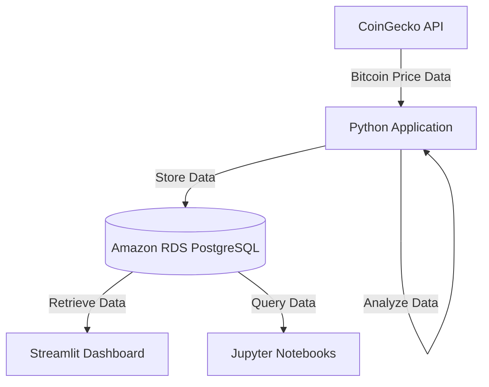
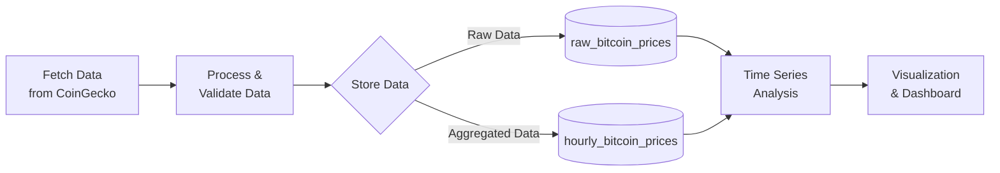
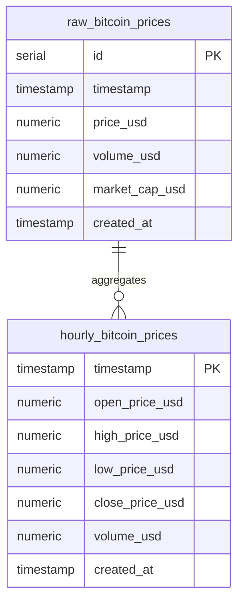

# Bitcoin RDS - Real-Time Bitcoin Data Processing using Amazon RDS

This project demonstrates real-time Bitcoin price data processing using Amazon RDS for storage and analysis.

## Prerequisites

- Docker installed on your system
- Docker Compose installed
- An Amazon RDS PostgreSQL database instance

## Project Overview

This project integrates real-time Bitcoin data with Amazon RDS for storage and analysis. The implementation follows these key steps:

1. **Setting up Amazon RDS**: Configuring a PostgreSQL database instance on AWS with appropriate security groups and parameters.

2. **Database Design**: Creating optimized schema with tables for raw Bitcoin price data and hourly aggregated data.

3. **Data Ingestion**: Using Python to fetch real-time and historical Bitcoin data from the CoinGecko API and storing it in RDS.

4. **SQL Implementation**: Utilizing SQL queries for data manipulation, including creating tables with proper indexes, inserting real-time data, aggregating raw data into hourly summaries, and extracting time-series data for analysis.

   **Example SQL:**
   ```sql
   -- Create table for raw Bitcoin data
   CREATE TABLE raw_bitcoin_prices (
       id SERIAL PRIMARY KEY,
       timestamp TIMESTAMP NOT NULL,
       price_usd NUMERIC(20,8) NOT NULL,
       volume_usd NUMERIC(24,2),
       market_cap_usd NUMERIC(24,2)
   );
   
   -- Insert data example
   INSERT INTO raw_bitcoin_prices (timestamp, price_usd, volume_usd) 
   VALUES ('2023-04-15 14:30:00', 29876.45, 28145932.67);
   
   -- Query hourly aggregated data
   SELECT date_trunc('hour', timestamp) AS hour,
          AVG(price_usd) AS avg_price,
          MAX(price_usd) AS high_price,
          MIN(price_usd) AS low_price
   FROM raw_bitcoin_prices
   GROUP BY hour
   ORDER BY hour DESC;
   ```

5. **Time Series Analysis**: Implementing analytical techniques to identify trends, calculate technical indicators (RSI, moving averages), and detect patterns in price movements.

6. **Visualization**: Creating an interactive Streamlit dashboard to display real-time prices, historical trends, and analytical insights.

The project demonstrates how to leverage Amazon RDS as a managed database service for financial data processing and analysis.

## Usage

1. **Jupyter notebooks**:
   - `bitcoin_rds.API.ipynb`: API documentation and examples to describe the native API of RDS and CoinGecko
   - `bitcoin_rds.example.ipynb`: Complete usage example

2. **Streamlit dashboard**:
   - Real-time Bitcoin price visualization
   - Historical data analysis with RSI indicator
   - Database connection and management

## Project Structure

- `bitcoin_rds_utils.py`: Core utilities for Bitcoin data processing and RDS connections
- `bitcoin_dashboard.py`: Streamlit dashboard implementation
- `docker_data605_style/`: Docker configuration files for containerization
- `bitcoin_rds.API.md`: A description of the native API of RDS and CoinGecko
- `bitcoin_rds.example.md`: A markdown description of the project
- `README.md`: This file


## System Architecture

### System Components



### Data Processing Flow



### Database Relationship



## Database Schema

The project uses two primary tables in the PostgreSQL database:

### 1. raw_bitcoin_prices

Stores raw Bitcoin price data fetched from CoinGecko API.

| Column         | Type           | Description                                |
|----------------|----------------|--------------------------------------------|
| id             | SERIAL         | Primary key                                |
| timestamp      | TIMESTAMP      | Time when the price data was recorded      |
| price_usd      | NUMERIC(20,8)  | Bitcoin price in USD                       |
| volume_usd     | NUMERIC(24,2)  | Trading volume in USD                      |
| market_cap_usd | NUMERIC(24,2)  | Market capitalization in USD               |
| created_at     | TIMESTAMP      | Record creation timestamp (auto-generated) |

**Indexes**:
- `idx_raw_bitcoin_prices_timestamp` on the timestamp column for efficient time-based queries

### 2. hourly_bitcoin_prices

Stores aggregated hourly Bitcoin price data derived from raw data.

| Column         | Type           | Description                                |
|----------------|----------------|--------------------------------------------|
| timestamp      | TIMESTAMP      | Hour timestamp (PRIMARY KEY)               |
| open_price_usd | NUMERIC(20,8)  | Opening price for the hour                 |
| high_price_usd | NUMERIC(20,8)  | Highest price during the hour              |
| low_price_usd  | NUMERIC(20,8)  | Lowest price during the hour               |
| close_price_usd| NUMERIC(20,8)  | Closing price for the hour                 |
| volume_usd     | NUMERIC(24,2)  | Average trading volume during the hour     |
| created_at     | TIMESTAMP      | Record creation timestamp (auto-generated) |

**Indexes**:
- Primary key on `timestamp` 
- `idx_hourly_bitcoin_prices_close` on the close_price_usd column

## First-Time Setup

1. **Clone the repository**:
   ```
   git clone repository-url
   cd /tutorials1/DATA605/Spring2025/projects/TutorTask156_Spring2025_Real_time_bitcoin_data_processing_using_Amazon_RDS  # Navigate to the project's directory
   ```

2. **Create `.env` file**:
   Create a new `.env` file in the project root, then copy and paste the following content with your own RDS concredentials (or use the default credentials):
   ```
   RDS_HOST=your-database-host.region.rds.amazonaws.com
   RDS_PORT=5432
   RDS_DATABASE=bitcoin_db
   RDS_USER=your_username
   RDS_PASSWORD=your_password
   ```
3. Build and activate the thin environment:
   ```bash
   # Build the thin environment (done once per client)
   cd ~/src/tutorials1/helpers_root
   ./dev_scripts_helpers/thin_client/build.py
   
   # Activate the thin environment (do this every time you work on the project)
   source ~/src/tutorials1/dev_scripts_tutorials/thin_client/setenv.sh
   ```

4. **Build Docker images**:
   ```
   cd docker_data605_style
   ./docker_build.sh        # Builds the main Docker image
   ./docker_build_streamlit.sh  # Builds the Streamlit Docker image
   ```

## Running the Project

You have several options for running the project:

### Option 1: Run both Jupyter and Streamlit together (recommended)
```
cd docker_data605_style
./docker_start_all.sh
```
Then access:
- Jupyter at http://localhost:8888
- Streamlit at http://localhost:8080

### Option 2: Run Jupyter only
```
cd docker_data605_style
./docker_jupyter.sh
```
Access Jupyter at http://localhost:8888

### Option 3: Run Streamlit only
```
cd docker_data605_style
./docker_streamlit.sh
```
Access Streamlit at http://localhost:8080

Open `bitcoin_rds.example.ipynb` to run the complete implementation example, which includes:
   - Connecting to Amazon RDS PostgreSQL database
   - Ensuring database tables are properly set up
   - Retrieving historical Bitcoin price data from CoinGecko
   - Storing data in the RDS database
   - Analyzing price data with technical indicators (moving averages, RSI)
   - Visualizing price trends and patterns
   - Identifying key market events and their impact

### Expected Results

After running the notebook, you should see:

1. Bitcoin price data stored in your Amazon RDS database
2. Time series visualization of Bitcoin price trends over 60-day periods
3. Technical analysis charts showing moving averages and relative strength index (RSI)
4. Anomaly detection highlighting unusual price movements around key economic events
5. Overbought/oversold indicators to identify potential trading opportunities


## Troubleshooting

- **Database connection issues**: Verify your RDS credentials in the `.env` file
- **Docker build failures**: Ensure Docker is properly installed and running
- **Port conflicts**: If ports 8888 or 8080 are in use, modify the port settings in the Docker scripts
