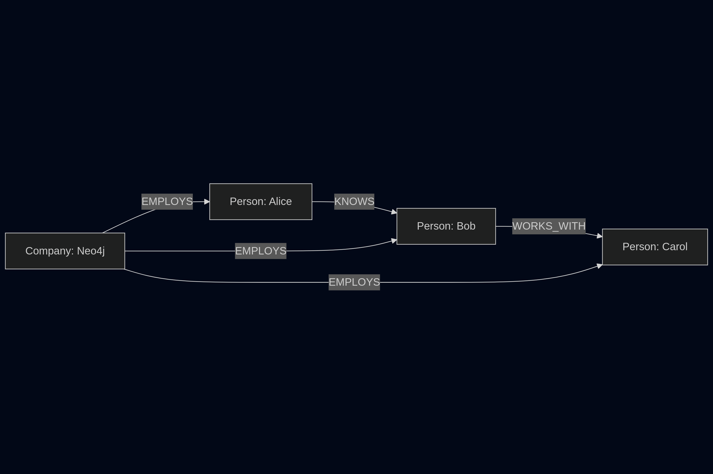
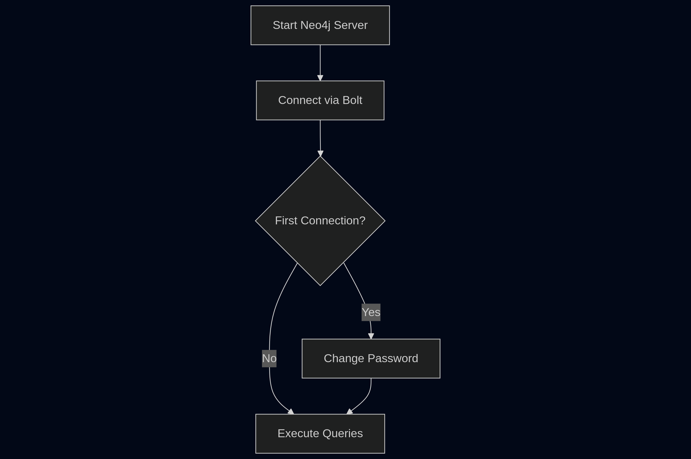
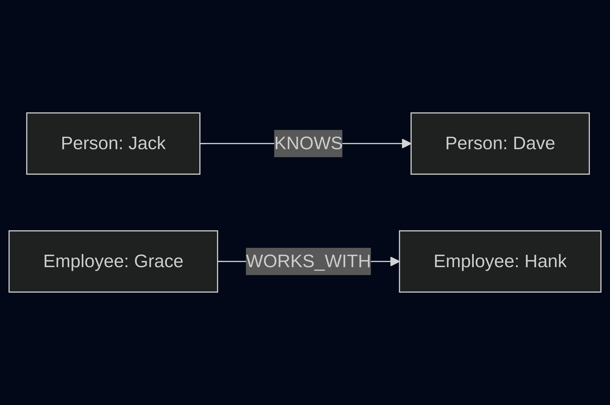

# Neo4j Tutorial

<!-- toc -->

- [Introduction](#introduction)
  * [Overview](#overview)
  * [Goals](#goals)
- [Docker Container](#docker-container)
- [Native API](#native-api)
  * [Starting server](#starting-server)
  * [Connecting to the server](#connecting-to-the-server)
    + [Updating the Password](#updating-the-password)
      - [Why Update the Password?](#why-update-the-password)
      - [Steps to Change the Password](#steps-to-change-the-password)
- [Creating Nodes](#creating-nodes)
  * [Functions for Node Creation](#functions-for-node-creation)
  * [General Process for Creating Nodes](#general-process-for-creating-nodes)
  * [Creating Relationships Between Nodes](#creating-relationships-between-nodes)
    + [General Process](#general-process)
- [Clauses in Neo4j](#clauses-in-neo4j)
  * [Write Clauses Key Operations](#write-clauses-key-operations)
  * [Read Clauses Key operations](#read-clauses-key-operations)

<!-- tocstop -->

## Introduction

### Overview

Neo4j is a graph database management system designed to handle large-scale,
highly interconnected data. It enables users to model data as nodes (entities)
and relationships (connections) with associated properties. This tutorial will
guide you through the essentials of Neo4j, its native API, and hands-on examples
using Python libraries like neo4j and py2neo.

An example of ER diagrams that can be modelled using Neo4j.



### Goals

The primary goal of this tutorial is to provide everything you need to:

- Understand the basics of Neo4j and graph databases.

- Set up and connect to Neo4j.

- Create, query, and manipulate data in Neo4j using Cypher.

- Explore visualization techniques for graph data.

## Docker Container

Steps to run the container:

```bash
> source dev_scritps_tutorial_neo4j/thin_client/setenv.sh
> i docker_build_local_image --version 1.1.0 --container-dir-name tutorial_neo4j
> i docker_jupyter --version 1.1.0 --skip-pull --stage local -d
```

## Native API

The native API serves as a python client to help us establish connection to a
`Neo4j` server.



### Starting server

This is first step in the process. We need need to have a running server in the
backend for us to work with.

1. **Default Ports**:
   - The Neo4j database server runs on HTTP port `7474` by default.
   - For query operations, the default Bolt protocol port is `7687`.

2. **Starting the Server**:
   - Use the following command to start the Neo4j server:

     ```bash
     sudo neo4j start
     ```
   - If the server is already running, you may see a message like:
     ```
     Neo4j is already running (pid:462).
     Run with '--verbose' for a more detailed error message.
     ```

### Connecting to the server

1. **URI and Authentication**:
   - To connect to the Neo4j server, you need the Bolt protocol URI and
     authentication credentials:

     ```python
     URI = "neo4j://localhost:7687"  # Default Bolt protocol URI.
     USER = "neo4j"                 # Default username.
     PASSWORD = "neo4j"             # Default password.
     ```

2. **Creating a Driver Instance**:
   - Use the `neo4j` Python driver to establish a connection:

     ```python
     from neo4j import GraphDatabase

     # Create a driver instance.
     driver = GraphDatabase.driver(URI, auth=(USER, PASSWORD))

     # Verify the connection.
     driver.verify_connectivity()
     print("Connection established.")
     ```

Key functions Used:

- **`GraphDatabase.driver()`**:
  - Initializes the driver for connecting to Neo4j.
  - **Arguments**:
    - `URI` (str): The connection address for the Bolt protocol.
    - `auth` (tuple): A tuple of `(username, password)` for authentication.

- **`driver.verify_connectivity()`**:
  - Verifies the connection to the Neo4j database server.
  - Raises an exception if the connection fails; otherwise, no output.

#### Updating the Password

##### Why Update the Password?

- **Mandatory Step**: The default credentials (`neo4j/neo4j`) are required
  initially but must be changed for security.
- **Permanent Change**: Once updated, the password cannot be reverted unless you
  perform a clean reinstallation.

##### Steps to Change the Password

1. **Define the Password Change Logic**:
   - Use a transaction function to execute the Cypher command for changing the
     password:
     - **Cypher Command**:
       ```sql
       ALTER CURRENT USER SET PASSWORD FROM $current_password TO $new_password
       ```
     - **Arguments**:
       - `$current_password`: Your current password (default is `neo4j`).
       - `$new_password`: Your new secure password.

2. **Execute the Password Change**:
   - Use the `session.write_transaction()` method to call the password change
     function:
     - **Arguments**:
       - `change_password`: The function to update the password.
       - `current_password`: Pass the current password as an argument.
       - `new_password`: Pass the desired new password as an argument.

3. **Reconnect with the New Password**:
   - After the password is updated, create a new driver instance using the
     updated credentials.
   - Verify the connection using `driver.verify_connectivity()`.

4. **Deprecation Warning**:
   - If using older Neo4j driver versions, the method `write_transaction` is now
     renamed to `execute_write`. Adjust your code accordingly to avoid warnings.

## Creating Nodes

1. **Node Basics**:
   - A **node** is a fundamental unit of data in Neo4j. It can have:
     - **Labels**: Categorize the node (e.g., `Person`, `Employee`).
     - **Properties**: Key-value pairs associated with the node.

2. **Key Operations**:
   - **`CREATE` Statement**: Used to create nodes in the database.
   - **Transaction Methods**:
     - `tx.run()`: Executes a Cypher query within a transaction.

### Functions for Node Creation

1. **Create a Simple Node**:
   - **Use Case**: Suppose you want to add a person named "Dave" to your
     database.
     - You can use the `CREATE` statement in Cypher to create a node with a
       specific label (e.g., `Person`) and a property (`name`).
     - Example:

       ```cypher
       CREATE (a:Person {name: $name})
       ```
     - **Details**:
       - The `tx.run()` method allows passing the query and arguments.
       - Here, `$name` is a parameter placeholder, and its value (e.g.,
         `"Dave"`) is passed as an argument.
       - Although not a standard practice, the property values can also be
         assigned directly, e.g.,:

       ```cypher
       CREATE (a:Person {name: "Dave"})
       ```

2. **Create a Node with Multiple Labels**:
   - **Use Case**: Consider creating a node that represents a person named
     "Hank" who is also an employee.
     - You can assign multiple labels (e.g., `Person` and `Employee`) to the
       same node:

       ```cypher
       CREATE (a:Person:Employee {name: $name})
       ```
     - **Details**:
       - Multiple labels are separated by a colon (`:`).
       - This approach helps categorize nodes under multiple groups for better
         querying.

3. **Create a Node with Multiple Properties**:
   - **Use Case**: You want to create a node for "Ivy" with additional details
     like age and city.
     - Use the `CREATE` statement with a label (`Person`) and multiple
       properties:

       ```cypher
       CREATE (a:Person {name: $name, age: $age, city: $city})
       ```
     - **Details**:
       - Properties are key-value pairs, passed as a dictionary in the code
         (e.g., `{"name": "Ivy", "age": 28, "city": "New York"}`).
       - This makes the node richer with more descriptive data.

4. **Create a Node and Return It**:
   - **Use Case**: Suppose you want to create a node for "Jack" and immediately
     confirm it was added successfully.
     - You can use the `RETURN` clause in Cypher to fetch the created node:

       ```cypher
       CREATE (a:Person {name: $name}) RETURN a
       ```
     - **Details**:
       - The `RETURN` clause ensures the created node is available in the
         result.
       - The resulting node can be accessed programmatically for further
         actions.

### General Process for Creating Nodes

1. Use `CREATE` to define the node structure (labels and properties).
2. Pass the query and parameters to `tx.run()` to execute it.
3. Optionally, use `RETURN` to retrieve the created node for confirmation.

**Example in Code**:

If you want to create a node with the label `Person` and the property
`name: "Dave"`, the query will look like this:

```python
tx.run("CREATE (a:Person {name: $name})", name="Dave")
```

### Creating Relationships Between Nodes

1. **Creating a Simple Relationship**:
   - **Use Case**:
     Suppose you want to define that "Jack" knows "Dave".
   - **Query**:

     ```cypher
     MATCH (a:Person {name: $node1_name}), (b:Person {name: $node2_name})
     CREATE (a)-[:KNOWS]->(b)
     ```
   - **Details**:
     - `MATCH`: Finds the nodes based on their label (`Person`) and property
       (`name`).
     - `CREATE`: Adds a relationship of type `KNOWS` between the two nodes.

2. **Creating a Relationship with Properties**:
   - **Use Case**:
     You want to record that "Grace" works with "Hank" since 2020.
   - **Query**:

     ```cypher
     MATCH (a:Employee {name: $node1_name}), (b:Employee {name: $node2_name})
     CREATE (a)-[:WORKS_WITH {since: $since}]->(b)
     ```
   - **Details**:
     - **Relationship Type**: `WORKS_WITH` categorizes the relationship.
     - **Properties**: Add key-value pairs (e.g., `since: 2020`) to store
       additional information about the relationship.

#### General Process

1. **Identify Nodes**:
   - Use the `MATCH` clause to locate the nodes involved in the relationship.
   - Nodes are identified by their labels and unique properties (e.g., `name`).

2. **Define the Relationship**:
   - Use the `CREATE` clause to specify:
     - The direction of the relationship (e.g., `(a)-[:KNOWS]->(b)`).
     - Any properties associated with the relationship.

3. **Transaction Execution**:
   - Pass the query and parameters to `tx.run()` within a transaction.

**Example Relationships in the Graph**

1. **Nodes**:
   - (\_0:Person {name: 'Jack'})
   - (\_1:Person {name: 'Dave'})
   - (\_2:Employee {name: 'Grace'})
   - (\_3:Employee {name: 'Hank'})

2. **Relationships**:
   - (\_0)-[:KNOWS]->(\_1): Jack knows Dave.
   - (\_2)-[:WORKS_WITH {since: 2020}]->(\_3): Grace works with Hank since 2020.



**Note**: Relationships are crucial in Neo4j as they define how nodes are
connected and enable efficient traversal and querying.

## Clauses in Neo4j

### Write Clauses Key Operations

1. **MERGE Clause**:
   - **Purpose**: Ensures the node or relationship exists in the database:
     - If it exists, it is matched.
     - If it doesn't exist, it is created.
   - **Use Case**:
     - Add a person named "Charlie" to the database if not already present.
     - Add a `KNOWS` relationship between "Alice" and "Charlie" if it doesn't
       already exist.
   - **Query**:

     ```cypher
     MERGE (a:Person {name: $name, age: $age})
     ```

     ```cypher
     MATCH (a:Person {name: $node1_name}), (b:Person {name: $node2_name})
     MERGE (a)-[:KNOWS]->(b)
     ```

2. **SET Clause**:
   - **Purpose**: Updates properties of a node or relationship.
   - **Use Case**:
     - Update the age of "Alice" to 31 and add a new property
       `city: 'New York'`.
   - **Query**:

     ```cypher
     MATCH (a:Person {name: $name})
     SET a.age = $age, a.city = $city
     ```

3. **DELETE Clause**:
   - **Purpose**: Removes nodes or relationships from the database.
   - **Use Case**:
     - Delete the `KNOWS` relationship between "Alice" and "Bob".

     ```cypher
     MATCH (a:Person {name: $node1_name})-[r:KNOWS]->(b:Person {name: $node2_name}, {node1_name: "Alice". node2_name: "Bob"})
     DELETE r
     ```
     - Delete the node "Bob" entirely.

     ```cypher
     MATCH (a:Person {name: $name}, name="Bob")
     DELETE a
     ```

### Read Clauses Key operations

1. **MATCH Clause**:
   - **Purpose**: Retrieves nodes, relationships, or paths that match a specific
     pattern.
   - **Use Case**:
     - Retrieve all nodes in the database.
     - Find nodes related to a specific entity.
   - **Examples**:
     - To find all nodes:

       ```cypher
       MATCH (n) RETURN n
       ```
     - To find employees working with "Grace":

       ```cypher
       MATCH (a:Employee {name: $name})-[:WORKS_WITH]->(Employee)
       RETURN Employee.name
       ORDER BY Employee.name
       ```

2. **OPTIONAL MATCH Clause**:
   - **Purpose**: Retrieves nodes and relationships, including those without
     connections.
   - **Use Case**:
     - Find people and who they know, even if some nodes don't have
       relationships.
   - **Example**:

     ```cypher
     OPTIONAL MATCH (a:Person)-[r:KNOWS]->(b:Person)
     RETURN a.name, b.name
     ```
   - **Output**:
     - Includes results for nodes with no `KNOWS` relationship by returning
       `null` for `b.name`.

3. **WHERE Clause**:
   - **Purpose**: Filters nodes or relationships based on specified conditions.
   - **Use Case**:
     - Retrieve all `Person` nodes where `age > 25`.
   - **Example**:

     ```cypher
     MATCH (a:Person)
     WHERE a.age > 25
     RETURN a.name, a.age
     ```

4. **COUNT Function**:
   - **Purpose**: Aggregates results by counting nodes, relationships, or paths.
   - **Use Case**:
     - Count all nodes with the label `Person`.
   - **Example**:

     ```cypher
     MATCH (a:Person)
     RETURN COUNT(a) as count
     ```
